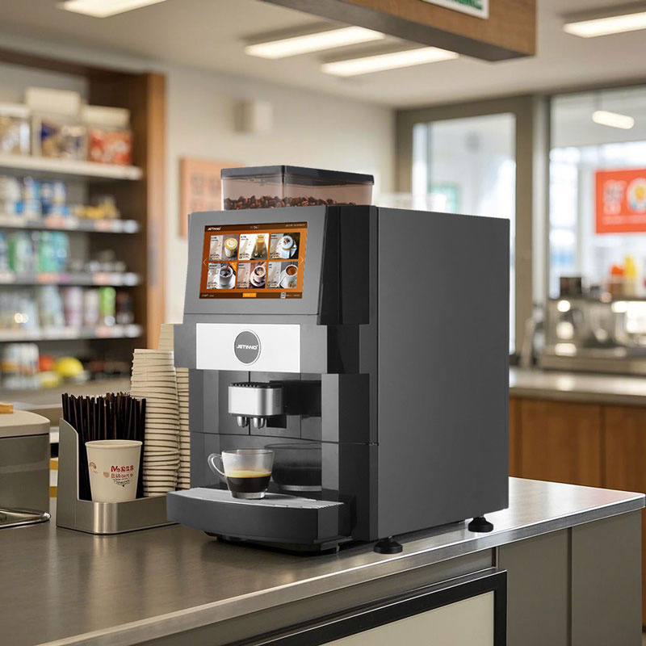
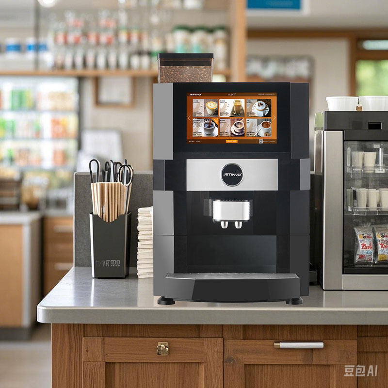
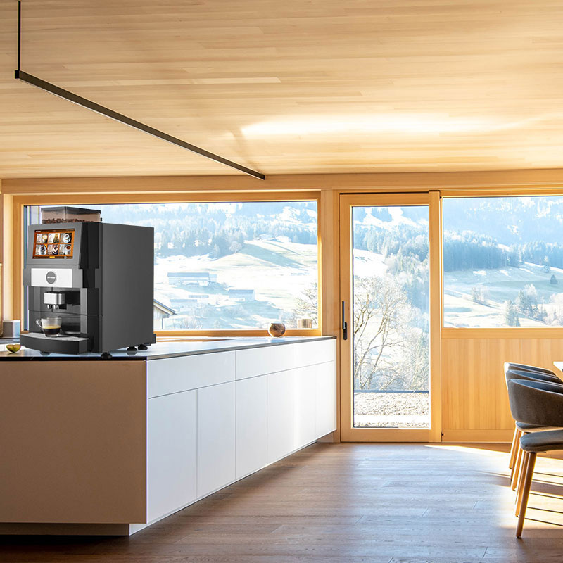
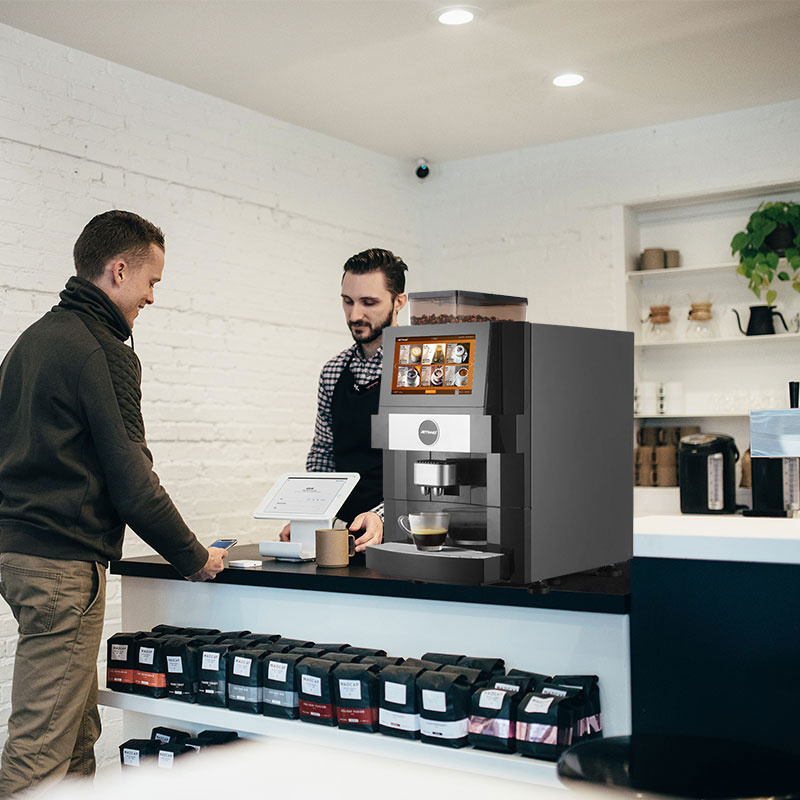

# Automatic Coffee Machines from China — Sourcing Brief

**Prepared:** 2026-08-14 · **Status:** research snapshot, no supplier contacted
**Scope:** market map, competitive wholesale price bands, verified supplier shortlist, product
photography, certification and import requirements, and a ready-to-send e-catalogue request.

Prices are **as published by suppliers on 2026-08-14**, in USD, and are indicative only. Every
manufacturer quotes finally against your spec, volume, voltage and Incoterm.

---

## 1. First: which machine are you actually sourcing?

"Automatic coffee machine" covers four very different products with a 50× price spread. Decide this
before you contact anyone — it determines the supplier, the MOQ and the certification burden.

| Category | Typical use | FOB price band | Typical MOQ |
|---|---|---|---|
| **A. Entry home/office bean-to-cup** | consumer retail, gifting, e-commerce | **$134 – $430** | 1 – 300 pcs |
| **B. Prosumer / premium home** | branded retail, hospitality rooms | **$799 – $950** | 1 – 2 pcs |
| **C. Commercial countertop bean-to-cup** | café, hotel, CVS, office (OCS) | **$1,130 – $7,200** | 1 – 2 pcs |
| **D. Self-serve / vending coffee machines** | unattended retail, forecourt, offices | **$1,000 – $5,500** | 1 – 24 sets |

If this is for a **vending or unattended-retail operation**, you want **category D** (and possibly C
for staffed locations) — not the $150 consumer units, which have no cash/cashless payment system,
no telemetry and no serviceable parts channel.

## 2. Competitive price benchmark

Verified published listings, grouped by category:

### A. Entry home/office bean-to-cup

| Product | Supplier (province) | Price | MOQ |
|---|---|---|---|
| Longbank WiFi 9-in-1 espresso w/ grinder | Ningbo Longbank Intelligence Appliance (Zhejiang) | **$134 – $155** | 300 pcs |
| Fully automatic w/ semiconductor milk container | Ningbo Wasai Home Appliances (Zhejiang) | **$243 – $272** | 1 pc |
| Commercial/home bean-to-cup cappuccino | (Alibaba listing) | **$280 – $380** | 1 pc |
| 3-variety automatic espresso maker | Good Seller Co. (Zhejiang) | **$408 – $428** | 10 pcs |

### B. Prosumer / premium home — Dr. Coffee

| Model | Price | MOQ | Note |
|---|---|---|---|
| H1 | **$799** | 1 | steam rod, home automatic |
| C11 (L) | **$800 – $850** | 1 | home bean-to-cup |
| C12 | **$880 – $950** | 1 | 4 L water tank |
| H2-B / H2-Cw | **$899** | 1 | bean-to-cup household |

### C. Commercial countertop bean-to-cup — Dr. Coffee

| Model | Price | MOQ | Note |
|---|---|---|---|
| F11 | **$1,130** | 1 | entry commercial |
| M12 Big Plus | **$1,880 – $2,440** | 2 | hotel use |
| Minibar / Minibar S1 | **$1,900 – $2,200** | 1 | 220V 50Hz EU plug |
| Coffeebar | **$2,400 – $2,500** | 1 | auto milk-system cleaning |
| F100-MP | **$3,250** | 1 | commercial espresso |
| F2-Plus | **$4,500 – $4,550** | 1 | high volume |
| F3plus / F3plus-T | **$7,000 – $7,200** | 1 | CVS flagship |

### D. Self-serve / vending — Jetinno and others

| Model | Supplier | Price | MOQ |
|---|---|---|---|
| JL31b | Jetinno | **$1,000 – $1,100** | — |
| Tabletop bean-to-cup vending | Guangzhou Evoacas | **$1,300** | 1 pc |
| JL38A (w/ chocolate bin, CE) | Jetinno | **$2,726 – $3,028** | 24 pcs |
| **JL23-ES4C (w/ flavour station)** | Jetinno | **$2,724 @ 24–49 sets · $2,452 @ 50+ sets** | 10 sets |
| Le308g hot/iced bean-to-cup vending | Hangzhou Yile Shangyun | **$4,700 – $4,800** | 1 pc |
| JL33A | Jetinno | **$5,000 – $5,500** | — |

**Read of the market:** the volume discount on these is shallow — Jetinno's JL23 drops only **10%**
going from 24 to 50+ sets. Unlike consumables, your leverage here is not raw quantity; it is
**specification, payment terms, spare-parts pricing and warranty length**. Negotiate those, not the
sticker.

## 3. Verified supplier shortlist

| Supplier | Location | Est. | Scale | Strength |
|---|---|---|---|---|
| **Suzhou Dr. Coffee System Technology** | Suzhou, Jiangsu | 2016 | 462 staff, ISO 9001:2015, 100+ countries | Deepest commercial bean-to-cup range, $799→$7,200; MOQ 1 on most models |
| **Guangzhou Jetinno Intelligent Equipment** | Huangpu, Guangzhou | 2016 | 12,407 m², 436 staff, 58 R&D engineers | Self-serve/vending specialist; CE + CB; 60+ after-sales staff |
| **Ningbo Merol Coffee Machine** | Ningbo, Zhejiang | 2005 | 22,000 m², 100k units/month | Volume OEM/ODM, 20+ export markets |
| **Colet** (Ningbo Hawk Electrical Appliance) | Ningbo, Zhejiang | ~15 yrs | — | Office/professional automatics, chocolate function |
| **Guangdong Gemilai Intelligent Technology** | Guangdong | — | — | Guangdong appliance cluster, OEM |

**Jetinno reference terms** (published, useful as a baseline to hold others to): FOB/CIF/CFR/EXW ·
LC, T/T, D/P, PayPal, Western Union · lead time **15 workdays off-season, ~1 month peak** · port
Guangzhou · 1-year mechanical defect warranty.

## 4. Product photography

Supplier product imagery for the Jetinno JL23-ES4C countertop bean-to-cup (see `images/`):

> **Note on supplier imagery.** At least one of these carries an AI-generation watermark, and several
> are clearly composited environment shots rather than photographs of a delivered unit. This is normal
> for Chinese B2B catalogues and is exactly why the request email below asks for **real photographs of
> the actual production unit, plus a video of it running** — not just the e-catalogue renders. Do not
> build your own listings on supplier renders without written permission and a physical check.

## 5. Sample specification — what a real spec sheet looks like

Two verified examples to use as a template when comparing quotes:

**Jetinno JL23-ES4C** (countertop) — 200 cups/day · 400 × 667 × 550 mm · 42 kg · 2,700 W ·
**220–240 V** · aluminium housing · 10+ drinks · pump pressure, fresh ground beans · CE, CB.

**Jetinno JL300** (floor-standing vending) — 200 cups/day · 664 × 1830 × 720 mm · **150 kg** ·
2,800 W · **220–240 V, 50/60 Hz** · 21.5" touchscreen · 700 ml / 2,700 W boiler · electromagnetic
pump · integrated water cooler · mains or bottled water · 6–8 × 4 L canisters · automatic cup
dispenser, 5 columns / 150 cups, 12 oz or 16 oz · WiFi + optional 4G telemetry · CB, CE, CQC, EAC.

## 6. Certification and import — the part that sinks first-time buyers

**Voltage is the single most common and most expensive mistake.** Every machine above is quoted at
**220–240 V 50 Hz** by default. US mains is **120 V 60 Hz** (or 208/240 V single-phase for larger
commercial units). A container of 220 V machines is unsellable in North America and cannot be fixed
with a plug adapter. **Put the voltage, frequency and plug type in writing on the proforma invoice.**

For the **US market**:

- **Electrical safety:** UL or ETL listing from an OSHA-recognised NRTL. UL and ETL are functionally
  equivalent. **China's CCC mark is not recognised in the US or EU** — it is worth nothing to you.
- **Commercial foodservice:** **NSF** certification for sanitation and material safety, required by
  many US health jurisdictions. ETL + NSF together is the standard commercial combination.
- **FDA food-contact compliance** for all wetted parts (tubing, brew group, milk lines).
- **Certification cost runs roughly $3,000 – $15,000** depending on complexity. Establish who pays,
  and whether the supplier already holds a valid US listing for the *exact* model — a certificate for
  a sister model is not transferable.
- **Tariff classification:** household electric coffee makers fall under **HS 8516.71** (US duty
  around 3.7% ad valorem on 8516.71.0020). Larger commercial machines can classify under **8419**, and
  misclassification is a common and costly pitfall. **Section 301 duties apply on top for China
  origin** — get a customs broker to confirm the line before you commit.

For the **EU/UK**: CE marking (UKCA for GB), with the technical file and Declaration of Conformity
held by the importer. 220–240 V is correct there, which is why the default quotes assume it.

None of this is legal or customs advice — confirm classification and duty with a licensed customs
broker before placing the order.

## 7. Supplier vetting checklist

- [ ] **Verify the factory, not the listing.** Ask for the business licence, and check the audited
      supplier report (Jetinno and Dr. Coffee both publish plant area, headcount and R&D staff).
- [ ] **Get a real unit on video** — running a full cycle, plus photographs of the actual machine.
- [ ] **Order one sample before volume**, at your target voltage, and run it for two weeks.
- [ ] **Spare parts and service.** Get a priced spare-parts list (brew group, grinder burrs, pumps,
      boilers, valves, touchscreen) and confirmed availability window. This is the real cost of
      ownership on an automatic machine, and it is where cheap suppliers fail.
- [ ] **Warranty in writing** — length, what it covers, who pays freight on warranty parts.
- [ ] **Certificates as PDFs with certificate numbers**, then verify the numbers on the issuing body's
      database yourself. Certificate forgery is common.
- [ ] **Payment terms** — 30% deposit / 70% against B/L copy, or an LC. Avoid 100% up front.
- [ ] **Photography rights** in writing if you intend to use the catalogue imagery.

## 8. Next step

`ECATALOGUE-REQUEST.txt` is a ready-to-send email requesting the e-catalogue, tiered pricing,
full specifications, certifications, voltage options and real product photography. Send it to all
five suppliers in §3 the same day so the replies are comparable, then log them in the comparison
table at the bottom of that file.

---

### Sources

- [Dr. Coffee official site](https://www.drcoffee.com/) · [Dr. Coffee Made-in-China showroom](https://dr-coffee.en.made-in-china.com/)
- [Jetinno JL23 listing (price/MOQ/specs)](https://jetinno.en.made-in-china.com/product/kfWYNatxsjhp/China-Jetinno-Jl23-Vending-Coffee-Machine-with-Flavor-Station.html) · [Jetinno JL300 specifications](https://www.jetinnomachine.com/vending/vending-machine-for-tea-and-coffee/hot-and-cold-coffee-vending-machine.html) · [Jetinno company site](https://www.jetinnovending.com/)
- [Made-in-China — fully automatic coffee machine listings](https://www.made-in-china.com/products-search/hot-china-products/Fully_Automatic_Coffee_Machine.html) · [Bean-to-cup listings](https://www.made-in-china.com/products-search/hot-china-products/Bean_To_Cup_Coffee_Machine.html)
- [Ningbo Merol showroom](https://www.made-in-china.com/showroom/martin_zhu6655/) · [Coffee machine supplier overview](https://cinoart.com/china-coffee-machine-supplier/)
- [NSF & ETL certification guide for espresso equipment](https://clivecoffee.com/blogs/learn/commercial-safety-certification-guide) · [US kitchen appliance regulations](https://www.compliancegate.com/kitchen-appliance-regulations-united-states/) · [Coffee maker CE vs UL certification](https://seller.alibaba.com/blogs/2026/southeast-asia/home-appliances/coffee-maker-ce-ul-certification-guide-alibaba-b2b)
- [HS code 8516.71 for electric coffee makers](https://www.freightamigo.com/en/blog/hs-code/hs-code-for-electric-coffee-makers/) · [CBP ruling N233651 — electric coffee brewers from China](https://rulings.cbp.gov/ruling/N233651)
