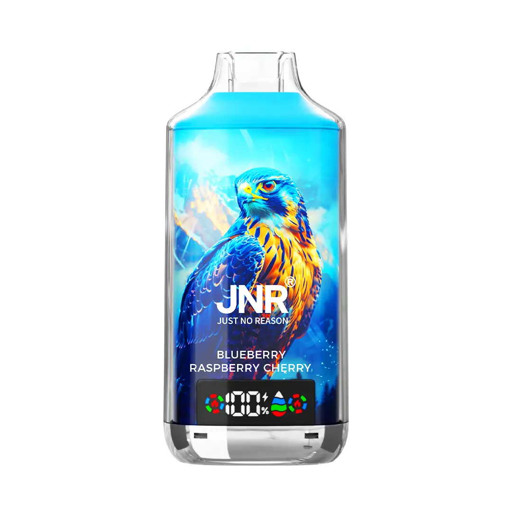
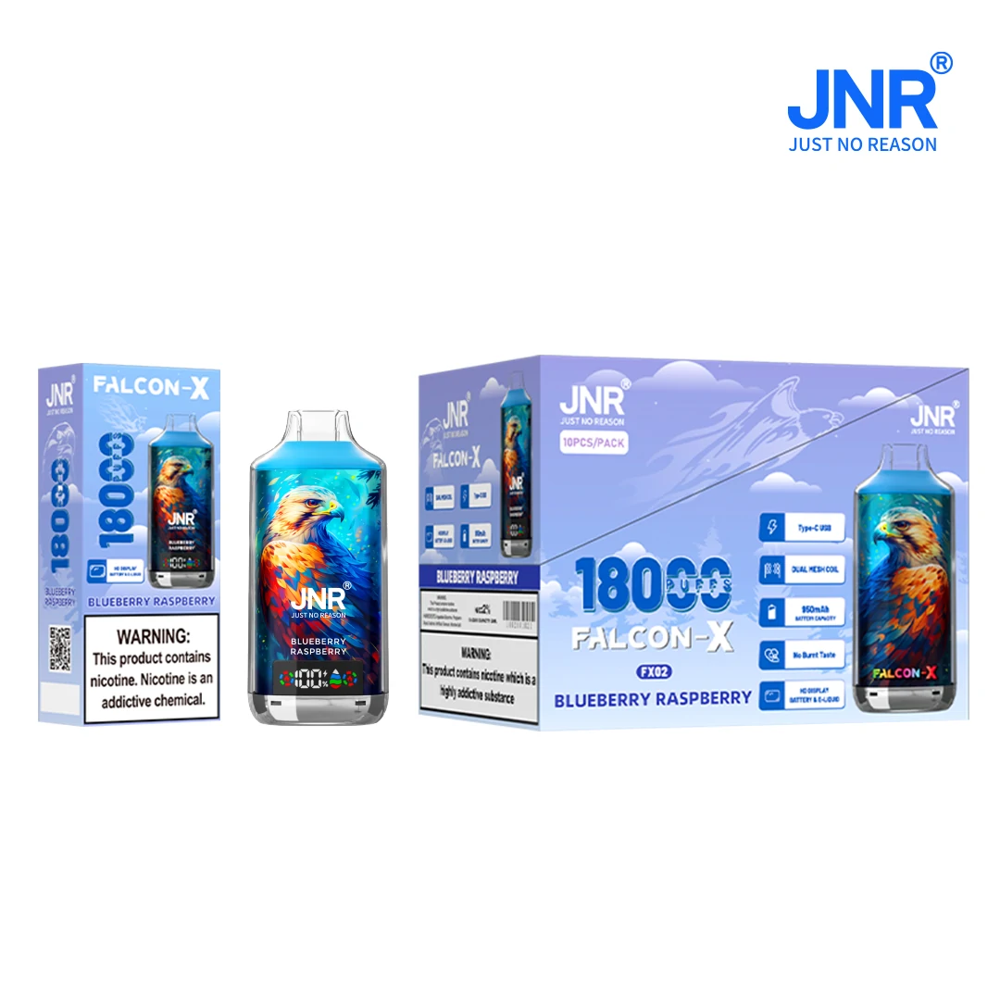

# JNR Falcon X 18000 — Bulk Purchase Sourcing Brief

**Prepared:** 2026-08-13 · **Status:** research snapshot, no order placed
**Scope:** competitive wholesale pricing, verified specs, product photography, supplier shortlist, compliance flags.

All prices below are **as published by each supplier on 2026-08-13** and are indicative only —
every wholesaler quotes final pricing per order (flavour mix, warehouse, Incoterm, payment method).
EUR→USD converted at **1 EUR = 1.1543 USD** (rate of 2026-08-13); re-check before committing.

---

## 1. Product identity

| | |
|---|---|
| **Brand owner** | JNR ("Just No Reason"), founded 2023 — official site `jnrvapor.com` |
| **Registered address** | Flat 13, 11/F The Icon, 320–322 Kwun Tong Rd, Kwun Tong, Kowloon, Hong Kong |
| **Operations** | Shenzhen, Guangdong, China |
| **Official sales contact** | sales@jnrvapor.com · marketing@jnrvapor.com |
| **Model** | Falcon X 18K (18,000 puffs) — sits between the Falcon 16K and the Falcon X⁺ 28K refillable |

> **Counterfeits are an active problem on this SKU.** JNR has published an anti-counterfeit
> statement naming imitations sold as **"JHR"**, **"VNR"** and similar look-alike marks, and says it is
> pursuing legal action globally. Genuine units carry a scratch-and-scan verification code.
> Verify any sample against JNR's official channel before paying for volume.

## 2. Verified specifications

Consistent across the manufacturer page and all four wholesalers checked:

| Spec | Value |
|---|---|
| Puff count | 18,000 (rated) |
| E-liquid capacity | 24 ml (dual 12 ml reservoirs) |
| Coil | 0.6 Ω dual mesh |
| Battery | 950 mAh rechargeable, UN38.3 certified |
| Charging | USB Type-C (5V/1A, ~2 h full charge) |
| Nicotine | 2% (20 mg) standard; **0% and 5% (50 mg) offered by some suppliers** |
| Display | Colour LED — battery % + e-liquid level |
| Airflow | Adjustable |
| Draw style | MTL (mouth-to-lung) |
| Unit weight | ~0.12 kg |
| Inner box | 10 pcs (single flavour per box on most factory-direct orders) |
| Master carton | 200 pcs / ~23.9 kg |
| Flavours | 29 confirmed on wholesale lists; JNR markets "50+" across the line |

**Flavour list (29, as stocked by EU wholesalers):** Blue Razz Ice · Blueberry Raspberry · Cool Mint ·
Kiwi Watermelon Ice · Grape Ice · Strawberry Kiwi · Strawberry Watermelon Ice · Watermelon Ice ·
Strawberry Ice · Mixed Berries · Watermelon Bubblegum · Sour Apple Ice · Peach Ice · Berry Burst ·
Blueberry Raspberry Cherry · Cherry Berry · Strawberry Banana · Passion Fruit Kiwi · White Peach Razz ·
Blue Razz Cherry · Cherry Watermelon Freeze · Cherry Cola · Banana Ice · Skittles · Triple Melon ·
Mr. Blue · Cherry Ice · Watermelon Lychee · Blueberry Kiwi.

## 3. Product pictures

Official manufacturer renders, downloaded from `jnrvapor.com` (see `images/`):

| File | Source URL |
|---|---|
| `jnr-falcon-x-disposable-vape-21.jpg` | https://ecdn6.globalso.com/upload/p/5119/image_other/2026-03/jnr-falcon-x-disposable-vape-21.jpg |
| `jnr-falcon-18k-disposable-puff-vape-5.webp` | https://ecdn6.globalso.com/upload/p/5119/image_other/2026-05/jnr-falcon-18k-disposable-puff-vape-5.webp |
| `jnr-falcon-18k-disposable-puff-vape-6.webp` | https://ecdn6.globalso.com/upload/p/5119/image_other/2026-05/jnr-falcon-18k-disposable-puff-vape-6.webp |

These are **manufacturer marketing renders**. For a listing you control, ask the supplier for the
official asset pack (studio shots, per-flavour packaging, lifestyle) in writing with usage rights —
or shoot your own from the sample order. Do not scrape a competitor's photos.

## 4. Competitive price benchmark

Published tiers, cheapest first at volume:

| Supplier | Region / warehouse | MOQ | Published tiers | ≈ USD/unit |
|---|---|---|---|---|
| **vapehosale.com** | EU + China | 50 pcs | €5.50 → €5.20/pc at volume (ex-shipping) | **$6.35 → $6.00** |
| **sunmoonvape.com** | China (Macau contact) | 50 pcs | 50–200: €6.35 (free shipping) · 200–500: €5.85 · 500–2,000: €5.80 | **$7.33 → $6.69** |
| **elfvaping.com** | EU (duty-paid EU delivery) | 10 pcs | 10–29: €12.95 · 30–59: €9.19 · 60–99: €8.42 · 100–199: €7.77 · 200–499: €7.25 · 500–999: €6.86 · 1,000+: €6.60 | **$14.95 → $7.62** |
| **puffjnr.com** | China (Shenzhen) | 3 pcs | retail $12.67–$32.99; ~$7.55/unit at 500+ | **~$7.55** |
| **snagvape.com** | EU | 10 pcs | 10+: €10.71 · 30+: €9.73 · 50+: €9.29 | **$12.36 → $10.72** |
| **firevapeswholesale.com** | UK | box of 10 | ~£58.99 per box of 10 (≈ £5.90/unit) | — |

**Read of the market:**

- **True factory-direct floor is ≈ €5.20–€5.80 / $6.00–$6.70 per unit at 500–2,000 pcs**, ex-works
  China, before freight, duty and excise. Anything materially below that on a 18K-puff device with a
  950 mAh cell and 24 ml of liquid is a signal to check authenticity, not a bargain.
- **EU-warehouse stock carries a 15–30% premium** (elfvaping at €6.60–€7.25 vs €5.80 China-direct) —
  you are paying for duty-paid, 2–7 day delivery and no border risk. Often worth it.
- **snagvape and the retail-facing sites are not wholesale pricing.** €9.29–€12.95 is B2C/small-pack.
  Ignore them as a cost basis; useful only as a retail-price reference.
- **Your negotiating anchor:** open at €5.00/unit DDP on a 1,000-pc first order and expect to land
  near €5.60–€6.20 DDP, or €5.20–€5.50 EXW if you handle freight.

## 5. Supplier shortlist — who to actually contact

1. **JNR direct — sales@jnrvapor.com.** Always quote the brand owner first. Factory-direct pricing,
   authenticity guaranteed, and they can name their authorised distributor for your territory. Best
   for 1,000+ pcs or if you want an ongoing supply agreement / OEM.
2. **elfvaping.com (EU warehouse).** Best option if you need stock fast and want to skip customs
   exposure; transparent published tiers, low MOQ (10) so you can trial cheaply.
3. **vapehosale.com** — lowest published volume price (€5.20), 50 pc MOQ, both EU and China
   warehouses, 10 pcs/flavour minimum. Bank transfer only, no COD — treat that as a risk factor.
4. **sunmoonvape.com** — clean tier structure, free shipping at 50–200 pcs, carton data published
   (200 pcs / 23.9 kg), claims customs clearance included.

## 6. Compliance — read before you commit money

This is material to the purchase, not boilerplate. If you are buying into the **United States**:

- **No 18,000-puff disposable has FDA marketing authorization, and no JNR product is authorized.**
  The FDA's authorized-ENDS list is small and tobacco/menthol-dominated. Selling an unauthorized
  new tobacco product in the US violates the FD&C Act, and flavoured disposables are the FDA's
  primary enforcement target (warning letters, civil money penalties, seizures).
- **Border risk is now terminal, not just a delay.** The FY2026 appropriations act lets CBP **seize
  and destroy** unauthorized vape shipments at the border rather than detain them for review. A
  China-direct container that gets flagged is a total loss, not a rescheduled delivery. This alone
  argues for domestic or duty-paid stock, or for not buying this SKU into the US at all.
- **State PMTA directory laws.** ~14 states now bar any ENDS not on a state registry (registries
  generally require FDA authorization or a timely-filed PMTA) — including AL, AR, FL, KY, LA, MS, NC,
  OK, PA, TN, UT, VA, WI, with Hawaii requiring full authorization. Effective dates are staggered
  through 2026–2027. **Verify your own state's registry status before ordering.**
- **PACT Act obligations.** ENDS are covered: register with ATF and with each state's tobacco tax
  administrator, file monthly sales reports, collect state/local excise tax, use age-verified adult
  signature delivery — and **USPS will not carry it**.
- **Tobacco 21** applies to every sale. If any of this stock is destined for **vending machines**,
  note that federal rules restrict tobacco/ENDS vending to **adult-only facilities** — a general-access
  location is not compliant.

Outside the US the picture differs: the EU sellers above ship duty-paid within Europe, but the
**EU TPD caps e-liquid tanks at 2 ml and nicotine at 20 mg/ml**, so a 24 ml / 18K-puff disposable is
**not TPD-compliant for legal retail in the EU** either, whatever the seller's site implies. Markets
where this device can be sold legally at retail are the exception, not the rule — confirm your
destination market's rules first, and get the supplier to state compliance in writing.

None of the above is legal advice; it is the set of questions to put to a licensed tobacco/vape
compliance attorney in your jurisdiction before wiring funds.

## 7. Supplier vetting checklist

- [ ] **Sample first.** 10–20 pcs before any volume order. Verify the scratch/QR authenticity code
      against JNR's official verification channel.
- [ ] **Confirm authorised-distributor status** by emailing sales@jnrvapor.com with the supplier name.
- [ ] **Get it in writing:** unit price, Incoterm (EXW / FOB / DDP), lead time, carton dimensions and
      gross weight, HS code, battery documentation (**UN38.3 + MSDS**, required for air freight).
- [ ] **Payment terms.** Bank-transfer-only with no escrow is the single biggest loss vector in this
      category. Push for 30% deposit / 70% on B/L copy, or pay via a channel with recourse.
- [ ] **Defect policy** in writing — DOA rate, replacement or credit, who pays return freight.
- [ ] **Photography rights** — written permission to use the official asset pack in your listings.
- [ ] **Flavour split** — most suppliers require 10 pcs minimum per flavour; plan the mix before quoting.

## 8. Next step

`RFQ-EMAIL.md` holds a ready-to-send inquiry (email + short WhatsApp variant) requesting exactly the
tiered pricing, terms, compliance documentation and photo assets above. Send it to all four suppliers
in §5 the same day so the quotes are comparable.

---

### Sources

- [JNR official — Falcon X 18K](https://www.jnrvapor.com/product/falcon-x/) · [JNR anti-counterfeit statement](https://jnrvapor.com/blog/jnr-anti-counterfeit-statement) · [JNR Falcon X⁺ 28K](https://www.jnrvapor.com/product/falcon-28k/)
- [SunMoonVape wholesale listing](https://www.sunmoonvape.com/products/jnr-falcon-x-18000-puffs-disposable-vape-e-cigs-2-5-nicotine-wholesale)
- [VapeHosale wholesale listing](https://vapehosale.com/product/wholesale-jnr-falcon-x-18000-puffs-disposable-vape/)
- [Elf Vaping tiered wholesale](https://elfvaping.com/product/jnr-falcon-x-18000-puffs-dual-mesh-digital-display-2-low-nicotine-bulk-buy-rechargeable-disposable-vapes-pen-wholesale/)
- [PuffJNR reseller listing](https://puffjnr.com/index.php/product/jnr-falcon-x-18000puff-disposable-vape/) · [SnagVape](https://snagvape.com/product/jnr-falcon-x-18000-18k-puffs-vape/) · [Fire Vapes Wholesale (UK)](https://www.firevapeswholesale.com/products/jnr-falcon-x-18000-puffs-box-of-10)
- [FDA — advisory and enforcement actions against unauthorized tobacco products](https://www.fda.gov/tobacco-products/compliance-enforcement-training/advisory-and-enforcement-actions-against-industry-unauthorized-tobacco-products)
- [State PMTA product registries overview](https://tokenoftrust.com/blog/14-states-now-have-active-pmta-product-registries-here-is-what-every-online-vape-retailer-must-do-before-july-1/) · [State vape registry laws and disposables, 2026](https://www.jellypuffs.com/blogs/news/state-vape-registry-laws-disposables-2026)
- [Federal Reserve H.10 foreign exchange rates](https://www.federalreserve.gov/releases/h10/hist/dat00_eu.htm)
