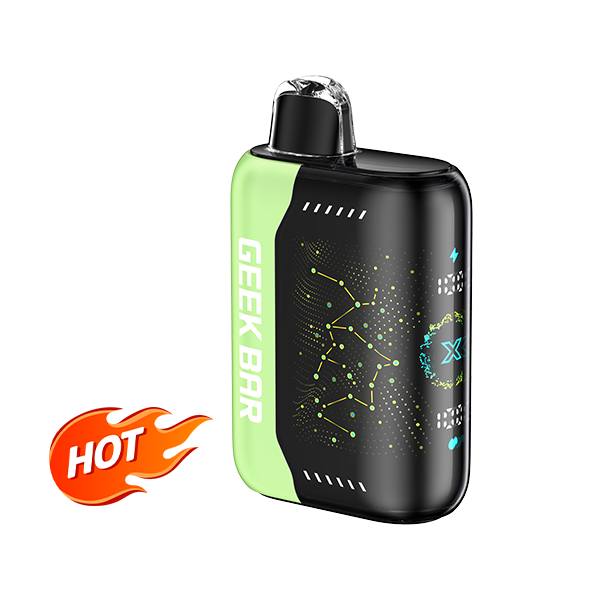
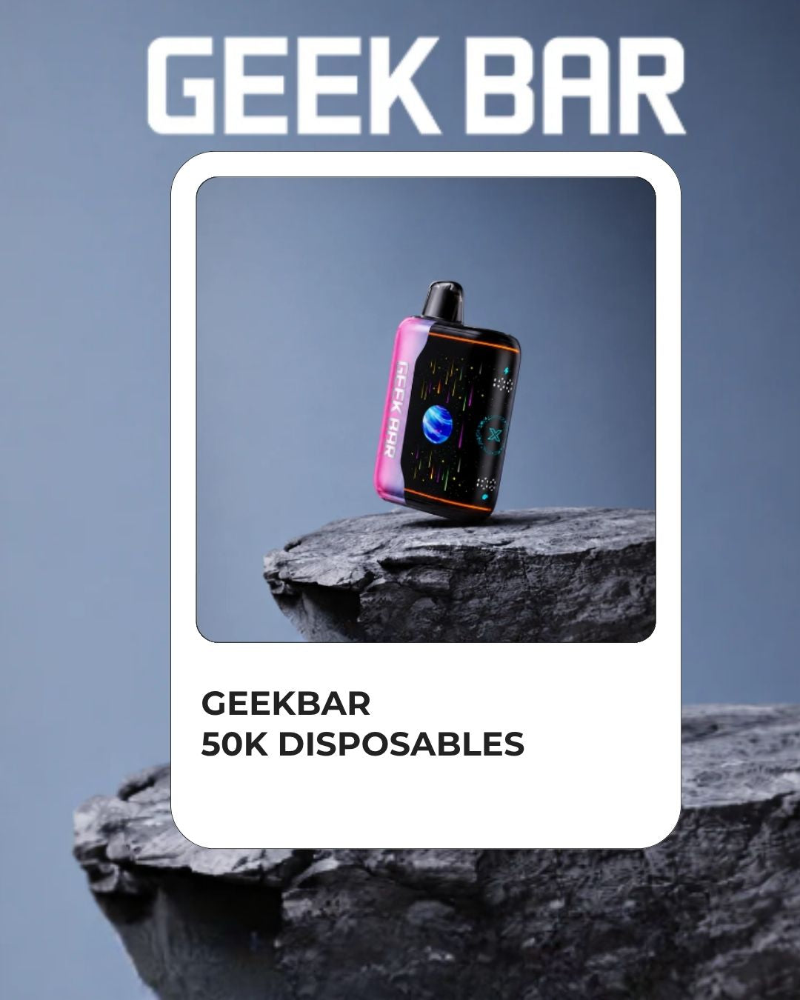
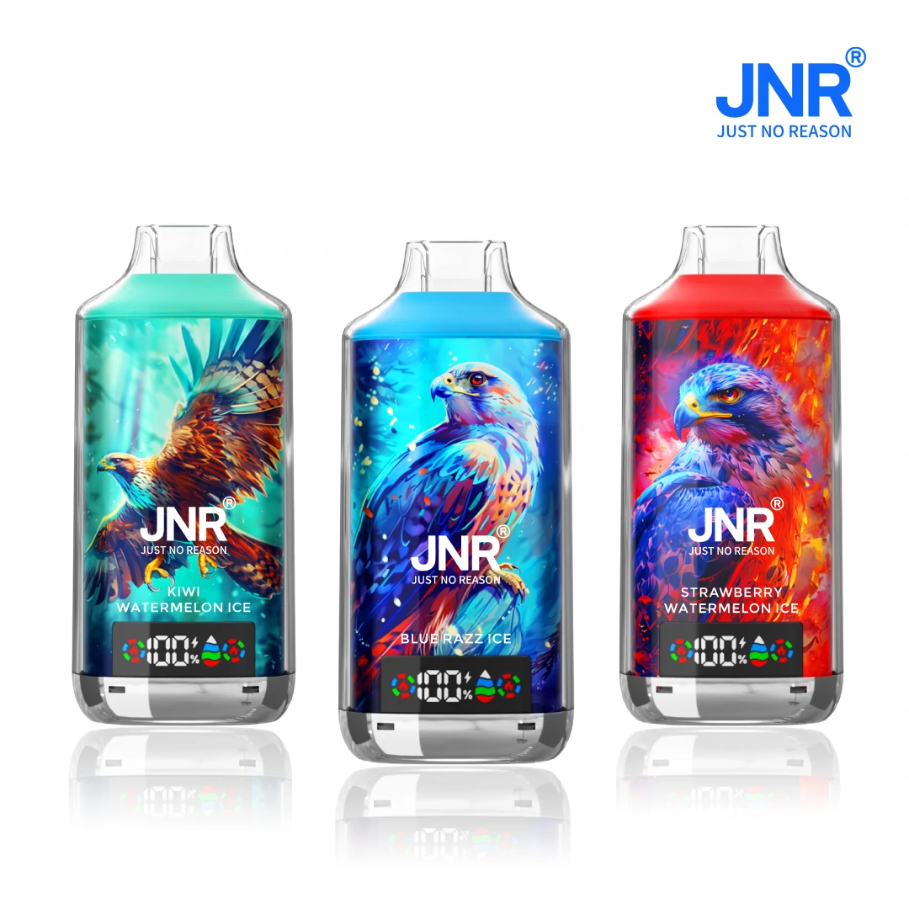

# Disposable Vapes — Multi-Brand Wholesale Catalogue

**Compiled:** 2026-08-14 · **Order size modelled:** **400 pcs** (= 80 displays of 5)
**Currency:** USD · **Basis:** US distributor wholesale list price, published 2026-08-14

Machine-readable version: `catalogue.csv`. Ready-to-send offer: `OFFER-EMAIL.txt`.

---

## The headline: the same SKU varies up to 77% between "wholesale" sites

This is the single most useful finding in the sweep, and it should drive the whole negotiation.

| Model | Cheapest found | Dearest found | Spread |
|---|---|---|---|
| **Lost Mary MT35000 Turbo** | **$9.50** (Get Glass) | $16.80 (EZPuff) | **+77%** |
| **Geek Bar Pulse 15K** | **$8.30** (Wisemen) | $10.00 (Get Glass) | +20% |
| Geek Bar CLR 50K | — | $17.00 (EZPuff) | — |

Several sites marketed as "wholesale" or "bulk" are really retail multi-packs. On a 400-pc order the
difference between $9.50 and $16.80 on one SKU is **$2,920**. Always price a specific model across at
least three distributors before committing.

**At 400 pcs you are above most volume thresholds.** Geek Bar volume pricing through Wisemen starts
above 50 displays; 400 pcs is 80 displays. Expect to be quoted *below* the published list prices
below — treat every number here as a ceiling, not a target.

## What 400 pcs costs, by tier

| Tier | Per unit | 400 pcs | Typical models |
|---|---|---|---|
| Entry / mid-puff (15K–40K) | **$7.00 – $8.30** | **$2,800 – $3,320** | Lost Mary MT15000, Adjust MyRusher 40K, Elf Bar BC Pro 40K, Geek Bar Pulse 15K |
| Core sellers (25K–50K) | **$9.50 – $13.00** | **$3,800 – $5,200** | Lost Mary MT35000, Geek Bar Pulse 2 / Pulse X / Pulse X2, Foger Bit 35K, Rinnbar 50K |
| Premium / flagship (50K+) | **$16.49 – $17.00** | **$6,596 – $6,800** | RAZ RX 50K, Geek Bar CLR 50K |
| Factory-direct China (18K) | **$6.00 – $7.60** | **$2,400 – $3,040** | JNR Falcon X 18K — see `../jnr-falcon-x-18000/` |

Retail benchmark: disposables retail at **$12–$25**, wholesale runs **40–60% below MSRP**, and
category margins run **80–150%**. At $8.30 in and $17.49 out, a Geek Bar Pulse 15K returns **$9.19
gross per unit — a 110% markup**, or roughly **$3,676 gross on 400 pcs**.

---

## A. Verified per-unit wholesale pricing

| Brand | Model | Puffs | $/unit | Display | Box price | Source |
|---|---|---|---|---|---|---|
| **Lost Mary** | MT15000 Turbo | 15,000 | **$7.00** | 5 | $35.00 | Get Glass |
| **Elf Bar** | BC Pro 40K | 40,000 | **$7.20** ⚠ | 5 | $36.00 | EZPuff (clearance) |
| **Adjust** | MyRusher 40K | 40,000 | **$7.50** | 5 | $37.50 | Get Glass |
| **Geek Bar** | Pulse 15K | 15,000 | **$8.30** | 5 | $41.50 | Wisemen |
| **Lost Mary** | MT35000 Turbo | 35,000 | **$9.50** | 5 | $47.50 | Get Glass |
| **Geek Bar** | Pulse 15K | 15,000 | $10.00 | 5 | $50.00 | Get Glass |
| **Geek Bar** | Pulse 2 | 25,000 | **$11.00** | 5 | $55.00 | Get Glass |
| **Foger** | Bit 35K | 35,000 | **$11.00** | 5 | $55.00 | Get Glass |
| **Rinnbar** | 50K | 50,000 | **$11.00** | 5 | $54.99 | Wisemen |
| **Geek Bar** | Pulse X | 25,000 | **$12.00** | 5 | $60.00 | Get Glass |
| **Foger** | Switch Pro 30K Kit | 30,000 | **$12.00** | 5 | $59.99 | Wisemen |
| **Geek Bar** | Pulse X2 | 50,000 | **$13.00** | 5 | $65.00 | Get Glass |
| **RAZ** | RX 50K | 50,000 | **$16.49** | 5 | $82.45 | EZPuff |
| **Lost Mary** | MT35000 Turbo | 35,000 | $16.80 | 5 | $83.99 | EZPuff |
| **Geek Bar** | CLR 50K | 50,000 | **$17.00** | 5 | $85.00 | EZPuff |
| **Foger** | Switch Pro Pods | 30,000 | $47.50 | 1 | $47.50 | Get Glass |
| **JNR** | Falcon X 18K | 18,000 | **$6.00 – $7.60** | 10 | factory direct | China FOB |

⚠ The Elf Bar BC Pro 40K at $7.20 is a **clearance price** (marked down from $70.00 per display).
Treat it as a one-off, not a repeatable cost basis.

Older 5K-class stock still moves at low prices: **Elf Bar BC5000** at $49.99–$119.99 per 10-pack and
**Lost Mary MO5000** at $50–$115 per 10-pack, depending on distributor and promotion.

## B. All brands available — full roster

Carried by the major US wholesale distributors. Pricing on request where not listed above.

### Tier 1 — top sellers by wholesale volume (2026)

**Geek Bar** (#1 in the US) · **Foger** · **Rinnbar** · **RAZ** · **Lost Mary** · **Funky Republic**

### Full brand list

| Brand | Notable models |
|---|---|
| **Geek Bar** | Pulse 15K · Pulse 2 25K · Pulse X 25K · Pulse X2 50K · Pulse X Platinum · Skyview 25K · CLR 50K · Clio Platinum 50K · Mate 60K · Lush 20K · Digiflavor BRK 20K |
| **Lost Mary** | MT15000 Turbo · MT35000 Turbo · MO5000 · MO20000 Pro · Ultrasonic 35K · NERA Fullview 70K |
| **Elf Bar / EB Design** | BC5000 · BC Pro 40K · VPR Ultra 7000 |
| **RAZ** | TN9000 · LTX DC25000 · RX 50K |
| **Foger** | Switch Pro 30K (modular pod system) · Bit 35K |
| **Rinnbar** | 50K |
| **Funky Republic** | Ti7000 |
| **Off-Stamp** | SW9000 (magnetic reusable battery dock) · SW16000 · X-Cube |
| **Vozol** | Rave 50K · Mega 50K |
| **Sea** | XS 15000 |
| **Adjust** | MyRusher 40K |
| **JNR** | Falcon X 18K · Falcon 16K · Falcon X⁺ 28K · 55K |
| **Oxbar** | full range |
| **Fume** | full range |
| **Breeze** | Breeze Pro |
| **Al Fakher** | full range |
| **Tyson 2.0** | full range |
| **Mr. Fog** | full range |
| **Myle** | full range |
| **HQD** | full range |
| **Air Bar** | full range |
| **Kado Bar** | full range |
| **Esco Bar** | full range |
| **Flum** | full range |
| **North / South / Velocity** | full range |
| **Chris Brown** | branded collab range |
| **Snoop Dogg** | branded collab range |
| **Juul · Vuse** | closed-pod systems (FDA-authorized products exist in these lines) |
| **SMOK · Geekvape · Voopoo · Uwell · Vaporesso · Lost Vape** | devices and pod systems |
| **Pod Juice · Jam Monster · Candy King · Reds Apple · Air Factory** | e-liquids |

> **Excluded from this catalogue:** THC/HHC products (Hidden Hills, Plug Play and similar) appear on
> some of the same distributor sites. They are a different product category under a different legal
> regime and should never be bundled into a nicotine vape order.

## C. Distributor shortlist

| Distributor | Notes |
|---|---|
| **Wisemen Wholesale** | 10,000+ SKUs, 50+ brands, **zero minimum order**, volume pricing above 50 displays. Cheapest verified Geek Bar Pulse 15K at $8.30. |
| **Get Glass Distribution** | Cheapest verified Lost Mary MT35000 at $9.50. Broad Geek Bar / Lost Mary / Foger range. |
| **World Vape USA** | Licensed in all 50 states, nationwide shipping. |
| **Golden Eagle Distributors** | Low MOQ, free shipping, very wide brand roster incl. Juul, Vuse, Breeze, Tyson. |
| **EZPuff** | Carries flagship 50K models; **prices notably higher — verify against others before ordering.** |
| **Durity Distribution · VapeRanger · Prime Supply Distro · KangerWholesale USA · Friendly Vape (Las Vegas) · Vape Wholesale Atlanta · XL Vape** | Additional quotes worth pulling |

## D. Product pictures

Sample imagery in `images/` — Geek Bar CLR 50K and JNR Falcon X 18K:

**On photography for the rest of the range.** Product imagery for Geek Bar, Lost Mary, Elf Bar, RAZ
and the other brands is owned by those brands, not by the distributor and not by you. The correct
route is to **request the official asset pack from your distributor** — brands supply them to
authorised resellers, with usage terms. Do not scrape a competitor's listing photos. `OFFER-EMAIL.txt`
asks for the asset pack explicitly.

## E. Before you place a 400-pc order

**What you need in place as the buyer** (per distributor onboarding requirements):

1. State tobacco/vape retail licence
2. Federal EIN
3. **PACT Act registration with the ATF** — required to legally receive shipments
4. Local business licences or municipal permits
5. Age-verification system (21+)

**What still applies to the product itself.** As set out in `../jnr-falcon-x-18000/README.md` §6:
no high-puff flavoured disposable in this catalogue holds FDA marketing authorization; roughly 14
states now run PMTA registries that exclude them; and CBP can seize and destroy unauthorized vape
imports at the border. That constrains which of these brands you can lawfully stock, and where.
**Check your state's registry before choosing brands** — it may decide the shortlist for you.

**Counterfeits.** Suspiciously low pricing is the standard red flag, alongside unverifiable business
registration, pressure to place a large first order, and inconsistent branding. Ask every distributor
for authorised-partnership confirmation and PMTA status documentation, and verify authenticity codes
on arrival.

## F. Recommended approach for this order

1. **Pick 3–4 SKUs, not 15.** 400 pcs spread across four models at 100 each gives real sell-through
   data; spread across fifteen it gives you nothing.
2. **Quote each SKU across Wisemen, Get Glass and World Vape** on the same day. The 20–77% spread
   above is free money for an hour's work.
3. **Lead with the proven sellers** — Geek Bar Pulse 15K at $8.30 and Lost Mary MT35000 at $9.50 are
   the strongest verified price-to-demand combinations in the sweep.
4. **Ask for the 80-display volume price**, not the list price. It exists; it is just not published.

---

### Sources

- [Wisemen — vape wholesale guide](https://wisemenwholesale.com/blog/vape-wholesale-guide/) · [Wisemen — Geek Bar wholesale pricing](https://wisemenwholesale.com/blog/geek-bar-wholesale/)
- [Get Glass Distribution — all disposables](https://www.getglass.us/collections/all-disposable-vapes) · [EZPuff bulk](https://ezpuff.com/bulk-n-save/) · [Mega Vape USA](https://megavapeusa.com/collections/wholesale-disposable-vapes)
- [SmokeAxis — best wholesale vape distributors US 2026](https://smokeaxis.com/guides/best-wholesale-vape-distributors-us-2026) · [Prime Supply Distro — disposables wholesale guide](https://primesupplydistro.com/blog/complete-guide-to-disposable-vapes-wholesale-in-2026/) · [Golden Eagle Distributors](https://goldeneagledistributors.com/product-category/vape-shop/vapes/) · [World Vape USA](https://worldvapeusa.com/)
- [Grasscity — most popular disposable brands 2026](https://www.grasscity.com/blogs/guides/most-popular-disposable-vape-brands) · [VapeRanger — RAZ vs Geek Bar vs Lost Mary](https://vaperanger.com/blogs/news/raz-vape-vs-geek-bar-vs-lost-mary-which-one-sells-better/) · [Geek Bar official](https://geekbar.com/)
- [FDA — advisory and enforcement actions](https://www.fda.gov/tobacco-products/compliance-enforcement-training/advisory-and-enforcement-actions-against-industry-unauthorized-tobacco-products)
